# React Wedding Animation Template

This project is a React.js implementation of the Mr. & Mrs. professional animation wedding template. The original template featured intricate animations and designs, and this project aims to recreate the essence using React.js.

## Demo

## 

## ⚙️ Tech Stack

---

## Features

- **Animation:** The React implementation attempts to replicate the animated elements present in the original wedding template.

- **Component-based Structure:** Utilizes a component-based structure for modularity and reusability.

- **Responsive Design:** Ensures responsiveness across various devices for a seamless viewing experience.

**Project Images**

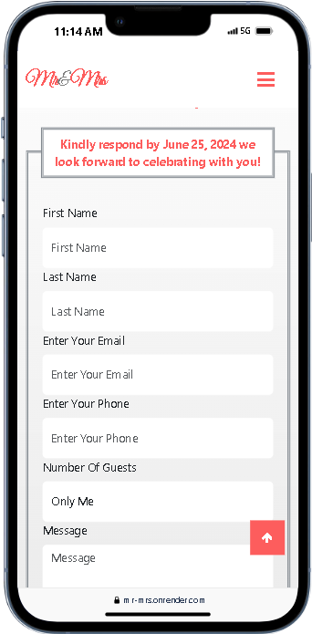
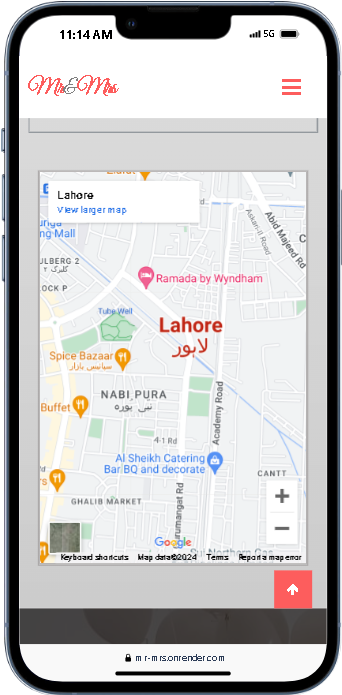
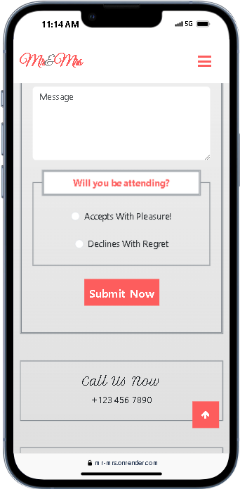

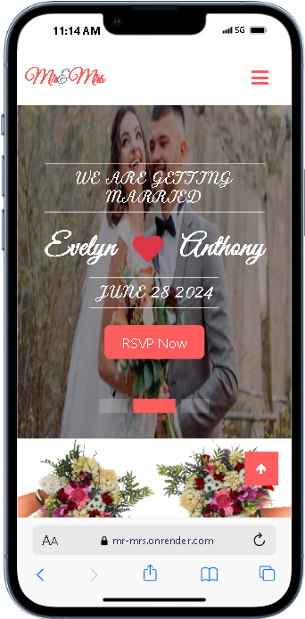
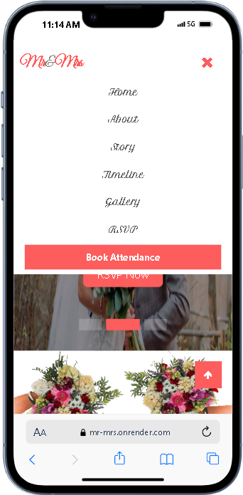
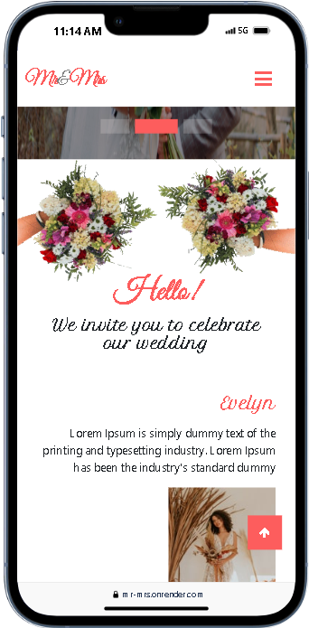

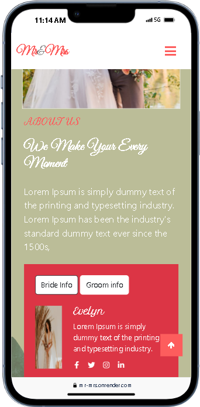
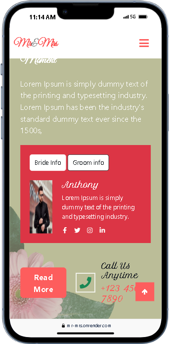

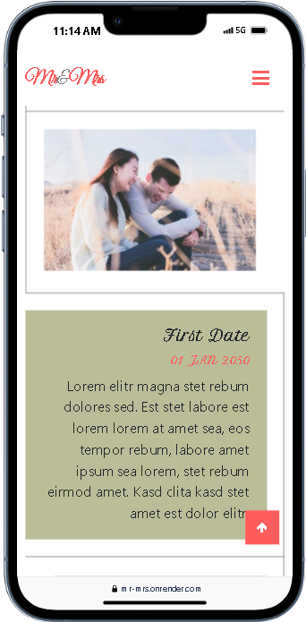
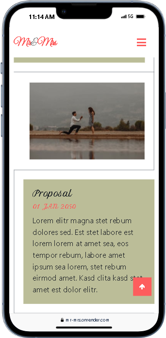
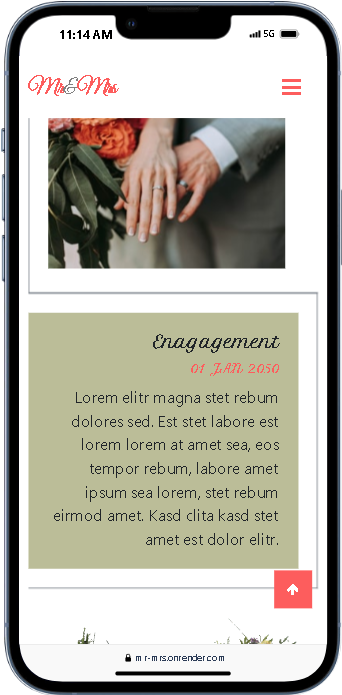
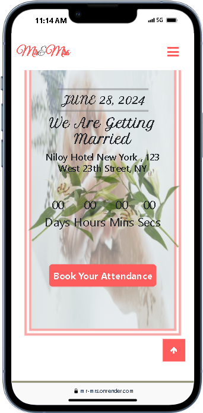
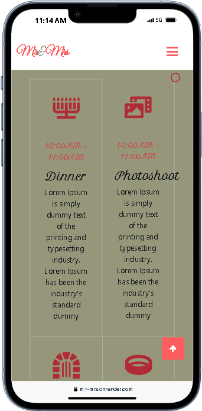
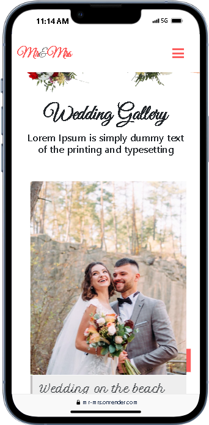
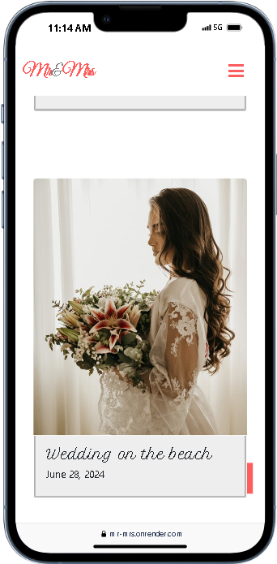
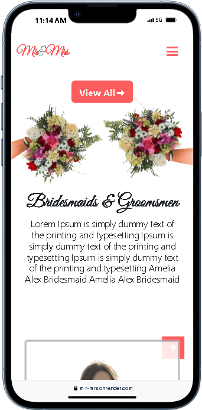

